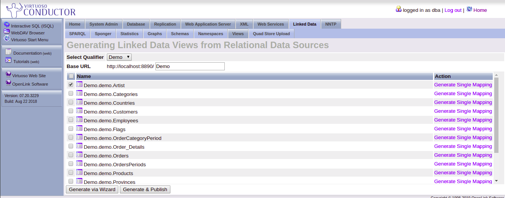

# Documentación VirtuosoInstalación y uso

<!-- TOC START min:2 max:3 link:true update:true -->
- [Introducción](#introducción)
- [Instalación](#instalacion)
- [Acceso a los datos](#acceso-a-los-datos)
  - [JDBC](#jdbc)
  - [Jena](#jena)
- [Representación de grafos RDF en tablas SQL](#representacion-de-grafos-rdf-en-tablas-sql)
- [Mapeo de datos SQL a RDF](#mapeo-de-datos-sql-a-rdf)

<!-- TOC END -->


## Introducción

Virtuoso es un moderno sistema de soluciones para el acceso y almacenamiento de datos, virtualización, integración y acceso multimodelo a tablas relaciones (acceso SQL o grafos RDF).Técnicamente es un middleware y motor de bases de datos híbrido que combina la funcionalidad de las bases de datos relacionales, objeto-relacionales,
RDF, XML, con aplicación web y sistema de ficheros propio. Permite el acceso a los datos vía SPARQL, ODBC, JDBC, ADO.NET, XMLA, WebDAV y Virtuoso/PL (que es un lenguaje de almacenaje SQL procedural) entre otros.
Gracias a que tienen un servidor web, permite la visualización de los datos, el manejo de ellos, la administración los usuarios (creación, eliminación, permisos...) y la visualización de las consultas realizadas de una manera muy sencilla y optimizada. También funciona como un servicio REST para poder realizar peticiones HTTP sobre los datos. 
En el campo de la web semántica, Virtuoso permite el almacenamiento de datos mediante grafos RDF, SPARQL como lenguaje de consultas con unaintegración con SQl, permite una transformación de datos relacionales como tripletas RDF y el manejo absoluto de estos grafos de manera muy sencilla mediante un servidor web.


## Instalación

Para instalar de Virtuoso mediante docker se tiene que proceder mediante github, descargando el repositorio:
https://github.com/IAAA-Lab/docker-virtuoso. Una vez se tiene, se puede observar que solo tiene un fichero (docker-compose.yml), este es el que contiene toda la información para su instalación, y en el que hay que realizar los cambios necesarios. En este fichero se pueden modificar los siguientes apartados: 
* **Ports**: en vez de 8890:8890 se puede poner 8890:XXXX donde XXXX es el puerto que desees que esté el servidor web. Lo mismo con 1111:1111 que es el servicio REST. 
* **Enviroment**: se puede modificar el nombre del usuario administrador inicial y su contraseña, así como el nombre de los grafos por defecto. 
* **Volumes**: es importante cambiar donde pone PATH por un directorio existente en el ordenador donde se vaya a instalar. Una vez se ha configurado todo se puede proceder a su instalación, con el comando:
```
docker-compose up -d
```
ejecutándolo dentro de la carpeta donde esté el fichero modificado anteriormente. 
Y ya estaría instalado, para acceder su puede hacer mediante el servicio rest en el puerto indicado antes (1111) o mediante el navegador web, introduciendo: http://localhost:8890 si no se ha cambiado el puerto. 
Para parar el servicio se tiene que ejecutar el siguiente comando en la misma carpeta: 
```
docker-compose stop
```

## Explotación del sistema Administración de usuarios

Para la administración de usuarios que puedan acceder al sistema se puede realizar desde la web, si eres administrador (el usuario creado al inicio lo es), en la sección de System Admin/User Accounts y ahí se puede crear usuarios, dándoles un nombre y una contraseña, pudiendo asignar un rol (funciona igual que cualquier otro gestor de bases de datos relacionales), una cuota de disco o si este usuario solo va a acceder a los datos mediante la web o vía ODBC.


Para otorgar privilegios de una base de datos específica a un usuario se puede utilizar el sistema de roles o privilegios, o también se le puede otorgar edición desde la propia base de datos, en la sección de privilegios y marcando el usuario en cuestión.


Otra posibilidad para la gestión de usuarios es mediante comandos SQl, que en este caso son los siguientes: 
* **user\_create(name, pass)** 
* **user\_change\_password(nombre,old,new)** 
* **user\_drop(name, cascade?)**: el cascade permite borrar las tablas de este user si está a 1, 0 por lo contrario. 
* **GRANT**: igual que SQL estándar. Todos estos comandos se pueden ejecutar desde ISQL (interactive SQL) en la web o desde cualquier SQL nativo con acceso al servicio.

## Acceso a los datos 
### JDBC 
Para poder acceder al servicio desde JDBC, hay que incluir la librería virtjdbcX.jar a la aplicación java en cuestión. X es la versión que se desee utilizar. Para descargar esta librería, se tiene que hacer desde la siguiente página:
http://vos.openlinksw.com/owiki/wiki/VOS/VOSDownload, 
y elegir la versión más conveniente. Una vez descargado, se incluye en el proyecto y se puede utilizar de manera normal, como se utiliza cualquier JDBC de forma nativa. Hay que usar la siguiente configuración de conexión:
```
Connection conn =
DriverManager.getConnection("jdbc:virtuoso://localhost:1111/","UserName", "Pass");
```
Donde se puede cambiar el puerto por el que se haya especificado, y UserName y Pass por el nombre del usuario y la contraseña real. Hay un ejemplo en el siguiente enlace:

### Jena 
Para poder acceder a los datos mediante Jena, hay que crear primero el proyecto, para ello se utilizará el sistema maven de instalación de dependencias. Una vez se ha creado, se incluirán las siguientes dependencias en el fichero pom.xml: 
```
    <dependency>
        <groupId>org.apache.jena</groupId>
        <artifactId>jena-arq</artifactId>
        <version>3.9.0</version> 
    </dependency>

    <dependency>
        <groupId>org.slf4j</groupId>
        <artifactId>slf4j-simple</artifactId>
        <version>1.7.21</version>
    </dependency>
```
También hay que incluir las librerías: __Virtuoso Jena 3.0.x Provider JAR file__ y __Virtuoso JDBC 4 Driver JAR file__, desde la página:
http://vos.openlinksw.com/owiki/wiki/VOS/VOSDownload. 
Una vez se ha instalado todo esto, se procede a acceder al servicio, para ello se accede al grafo de la siguiente manera:
```
VirtGraph graph = new VirtGraph ("GraphName","jdbc:virtuoso://localhost:1111", "User", "yourPass");
```
Siendo GraphName el nombre del grafo creado o a crear. Una vez se ha realizado la conexión Jena ofrece un gran número de funciones que se exponen en el siguiente repositorio:

## Representación de grafos RDF en tablas SQL 
El motor de la base de datosde grafos RDF de Virtuoso guarda todas las tripletas en tablas SQL normales. De tal manera que el IRI (son una generalización de los URIS, que son identificadores universales de los recursos) de cada nodo se guarda en la tabla: DB.DBA.RDF\_IRI, poniendo el nombre y el identificador, IRI. Ejemplo de esta tabla:
|Example3   |  #i1269 |
|---|---|

Siendo #i1269 el IRI. 
Con estos IRIs se pueden saber las relaciones que hay entre los nodos, desde la tabla DB.DBA.RDF\_QUAD, en la que cada se puede ver todas las tripletas, incluyendo el nombre del grafo, pero en formato de URI. Ejemplo de esta tabla:

|Nombre grafo |Nodo1 |Predicado |Nodo2 |
|---|---|---|---|
|#i1269 |#i17968904 |#i17968905 |#i17968906 |


## Mapeo de datos SQL a RDF

Una de las grandes utilidades que tiene virtuoso es la capacidad de crear un mapeo directo e instantáneo entre tablas relacionales con grafos RDF. Esto es muy útil si se va a utilizar datos almacenados de manera relacional como datos de la web semántica, ya que esta transformación es rápida e intuitiva. Para mapear una tabla relacional como grafo RDF, solo hay que ir a la sección de Linked data/Views y seleccionar la tabla que se desee tener como una vista RDF. Una vez se tiene seleccionada, se tiene seleccionada se pulsa Generate via Wizard y saldrán una serie de opciones a personalizar, esto se hará al gusto (clave primaria, reglas de ontologías...).



Una vez se ha acabado de configurar como se desee, se pulsa Prepare to Generate, lo que genera una serie de ficheros que se ejecutarán para crear la vista. Ahí se puede elegir el nombre que tendrá el grafo. De tal manera, que al generar el grafo de una tabla SQL, se genera otra tabla SQL, pero con las propiedades RDF nombradas antes. Esta transformación/mapeo crea por cada fila de la tabla primaria una tripleta: id, grafo, nombre del grafo; siendo el id un identificador único creado para esto, y después por cada columna de la tabla otra tripleta: id, nombre columna, dato. de tal manera que quedaría así:

SQL:
|ArtistID (INTEGER) |CountryCode (VARCHAR) |Name (VARCHAR) |
|---|---|---|
|1 |nl   |RembrandtHarmenszoon van Rijn   |


RDF:
|http://localhost:8890/Demo/artist/ArtistID/1\#this |http://www.w3.org/1999/02/22-rdf-syntax-ns\#type   |http://localhost:8890/schemas/Demo/Artist   |
|---|---|---|
|http://localhost:8890/Demo/artist/ArtistID/1\#this   |http://localhost:8890/schemas/Demo/artistid   |1   |
|http://localhost:8890/Demo/artist/ArtistID/1\#this   |http://localhost:8890/schemas/Demo/countrycode   |nl   |
|http://localhost:8890/Demo/artist/ArtistID/1\#this   |http://localhost:8890/schemas/Demo/name   | Rembrandt Harmenszoon van Rijn  |


### Jorge Blázquez Hernández 11-1-2019